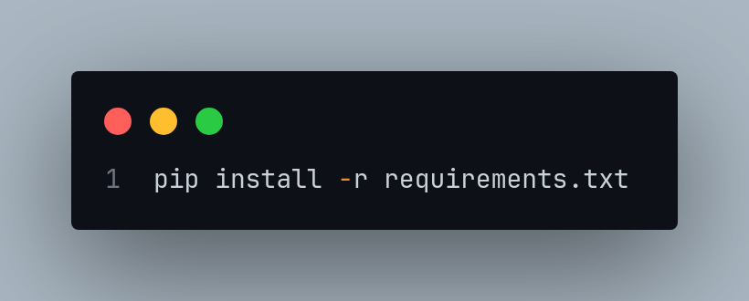

<h2>Computer Vision YOLO Models 📹 ✅</h2>

<p>
In this repository, a series of concepts and applications related to computer vision are applied using the YOLO architecture to use trained and pre-trained models, from the transformation of unstructured data to structured data to object detection
</p>

<h3>🔗 Project Architecture</h3>

<p>
Here we have a representation of the architecture of the application folders
</p>


```bash
📂 yolo-ai/
├── 📂 process/
│     └── main.py
├── 📂 services/
│     └── service-1
│     └── service-2
│     └── service-n ...
├── 📂 utils/
│     └── yolo_model_handler.py
├── 📂 video_capture/
│     └── main.py
├── 📂 yolo/
│     └── model-1.pt
│     └── model-2.pt
│     └── model-n.pt ...
├── 📂 video-capture/
│     └── video_capture_async.py
├── 📂 records/                    ⬅️ Folder used to store the videos to be processed by the AI
│     └── video-1.np4
│     └── video-2.np4
│     └── video-3.np4
│     └── video-n.np4 ...
├── 📂 records/                    ⬅️ Videos processed by AI
│     └── video-results-1.np4
│     └── video-results-2.np4
│     └── video-results-3.np4
│     └── video-results-n.np4
├── main.py
├── README.md
├── config.json
├── .gitignore
```

<h3>💡 Project Idea</h3>

<p>
The initial idea of ​​this project basically consists of collecting computer vision data through YOLO models, structuring this data in JSON and sending this data in real time to a Websocket API
</p>

<h3> 📃 Project Dependencies</h3>


<p>
To install all project dependencies, run the following command
</p>

